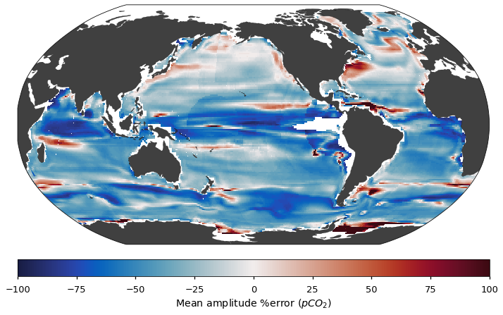

# Project 3: Algorithmic developments for reconstructing air-sea CO_2 exchange

### [Full Project Description](doc/project3_desc.md)

Term: Spring 2022

+ Team members
	+ Nan Zhang
	+ Ziwen Ye
	+ Kate Marsh
	+ Gabriel Weinstein

+ Project summary: 

In this project we implemented a LightGBM model with and without categorical variables in order to improve air-sea CO2 exchange modeling. LightGBM models are often able to train faster than XGBoost and require less memory to run. RAM was a consistent limiting factor in this project, and we made efforts to work around it. We used Collab pro in order to have more available ram and ran model tests seperately in order to save RAM.

In the end, we chose to represent accuracy with a quantile loss function on the LightGBM model with categorical features. We chose latitude (defined in 10 degree bands) and season as categorical features to improve model performace. Using light GBM with categorical features, we were able to reduce the MSE by 1/3 on the unseen data, reduce test speed, reduce bias, and increase r2 and correlation values compared to the original XGBoost model.

+ 	
**Contribution statement**: All team members contributed equally in all stages of this project. All team members approve our work presented in this GitHub repository including this contributions statement. 
